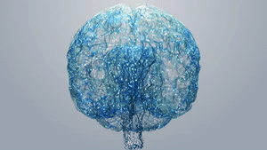

<!-- =========================================================
     ANDREW VILLAMAR | GITHUB PROFILE README
     Structure: Header, About, Technologies, Projects, Interests
     Required asset: cerebro.gif in the repository root
     ========================================================= -->

<!-- =========================== HEADER =========================== -->

<table width="100%" border="0" cellspacing="0" cellpadding="0">
  <tr>
    <td width="60%" valign="middle" align="left">

      <h1>
        Hi, I'm Andrew
        
      </h1>

      

      

        
        
      

    </td>

    <td width="40%" valign="middle" align="center">
      
    </td>
  </tr>
</table>

---

<!-- =========================== ABOUT ============================ -->

## 👨‍💻 About Me

I'm a third-year undergraduate student pursuing a degree in **Data Science and Artificial Intelligence at the Technical University of Madrid (UPM)**.

I'm interested in understanding how intelligent systems learn, interpret visual information, and solve complex computational problems. I enjoy combining mathematics, programming, and experimentation to understand not only how algorithms work, but also why they work.

- 🎓 Studying Data Science and Artificial Intelligence at UPM.
- 👁️ Interested in Computer Vision and Deep Learning.
- 🧠 Exploring visual speech recognition and facial movement analysis.
- ⚡ Interested in parallel computing and performance optimization.
- 📊 Working with statistical learning, predictive models, and data analysis.
- 🔬 Interested in AI research, neuroscience, and the mathematical foundations of intelligent systems.

---

<!-- ========================= TECHNOLOGIES ======================= -->

## 🛠️ Technologies & Tools

### Programming Languages

  
  
  

### Machine Learning & Scientific Computing

  
  
  
  
  

### Computer Vision

  
  

### Development Environment

  
  
  
  
  
  

---

<!-- =========================== PROJECTS ========================= -->

## 🚀 Projects & Academic Work

### 👄 Computer Vision: Webcam-Based Lip-Reading Prototype

A computer vision prototype exploring how visual information from facial and lip movements can be used for speech recognition without relying on audio input.

- Captures video through a webcam using OpenCV.
- Uses MediaPipe for facial landmark detection and head tracking.
- Processes visual input for a PyTorch-based recognition workflow.
- Experiments with offline visual speech recognition.
- Explores the foundations of silent communication interfaces.

**Technologies:** Python, PyTorch, OpenCV, MediaPipe.

<!-- Add the project repository link here when available. -->

---

### ⚡ High-Performance Computing: Matrix Multiplication in C

An experimental study of how memory hierarchy and low-level optimizations affect the performance of numerical algorithms.

- Implemented matrix multiplication in C using dynamically allocated memory.
- Compared compiler optimization levels, including `-O0` and `-O3`.
- Applied loop blocking to improve cache locality.
- Benchmarked alternative implementations and measured execution times.
- Investigated the relationship between memory access patterns and performance.

**Technologies:** C, GCC, Linux, cache optimization.

---

### 📊 Machine Learning: Traffic Data Analysis & Regression

An applied data analysis project focused on processing traffic measurements and comparing predictive approaches.

- Processed traffic datasets using Pandas and NumPy.
- Built regression models using scikit-learn.
- Compared linear and polynomial regression.
- Experimented with Ridge and Lasso regularization.
- Evaluated predictive performance using RMSE and R².

**Technologies:** Python, Pandas, NumPy, scikit-learn.

---

### 🧠 Neural Networks: Perceptron & Multilayer Perceptron

Neural network experiments focused on the mathematical and computational foundations of supervised learning.

- Implemented perceptron models and a multilayer perceptron (MLP).
- Represented weights and biases using NumPy arrays.
- Worked with a step activation function.
- Experimented with training, predictions, and accuracy evaluation.
- Monitored error and accuracy metrics across training iterations.

**Technologies:** Python, NumPy, neural networks.

---

### ⚙️ Parallel Computing & Performance Analysis

Experiments exploring how parallel execution strategies and data handling influence computational performance.

- Worked with Python multiprocessing and process pools.
- Explored inter-process communication and shared data.
- Experimented with arrays, values, queues, pipes, and managers.
- Compared sequential and parallel computational approaches.
- Investigated vectorized operations and execution-time benchmarking.

**Technologies:** Python, NumPy, multiprocessing, Jupyter.

---

### 🔎 Machine Learning: Model Selection & Evaluation

Experiments with predictive modelling, model comparison, and hyperparameter optimization.

- Worked with classical regression and machine learning models.
- Explored training, validation, and test data partitions.
- Experimented with randomized hyperparameter search.
- Compared models using quantitative performance metrics.
- Practised evaluating generalization on unseen data.

**Technologies:** Python, scikit-learn, NumPy, SciPy.

---

### 🗣️ Natural Language Processing (NLP)

Academic work in natural language processing and computational methods for working with human language.

**Focus:** Natural language processing and text-oriented machine learning.

<!-- Add the specific task, algorithms, and repository link here. -->

---

### 🌐 Social Computing

Academic work exploring computational approaches to social phenomena and digitally mediated interactions.

**Focus:** Social computing and computational analysis of human interaction.

<!-- Add the specific task, datasets, and repository link here. -->

---

<!-- =========================== INTERESTS ======================== -->

## 🔬 Research Interests

- Computer Vision and Visual Computing.
- Deep Learning and neural network architectures.
- Visual Speech Recognition and Facial Analysis.
- Natural Language Processing.
- Social Computing and computational analysis of interactions.
- Parallel Computing and Performance Optimization.
- Mathematical Foundations of Artificial Intelligence.
- Neuroscience and the relationship between computation and cognition.

---

<!-- ============================ FOOTER ========================== -->

  <i>Always learning, always exploring, always building.</i>

